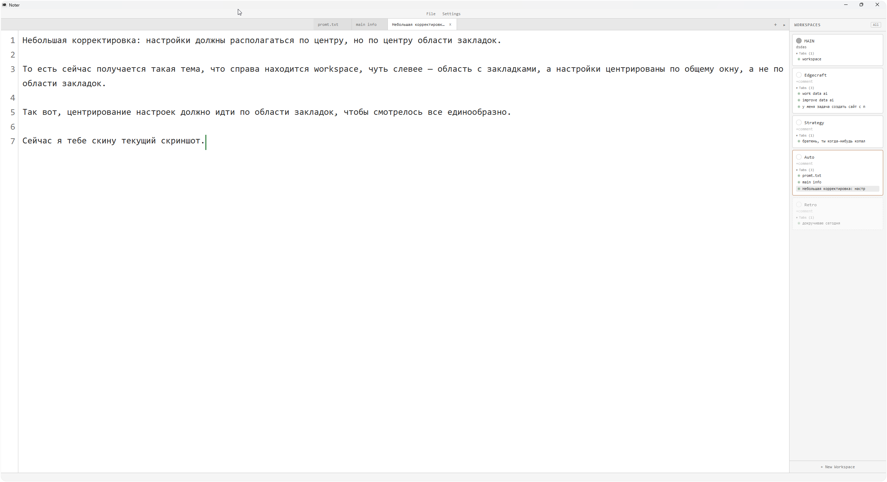
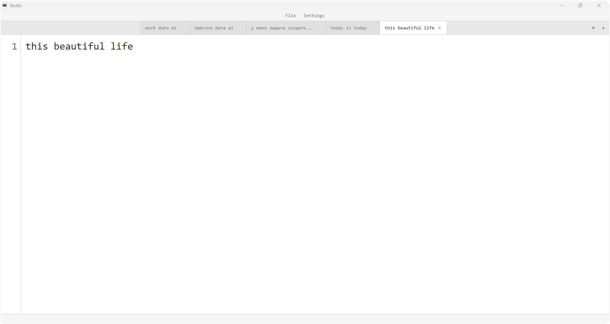
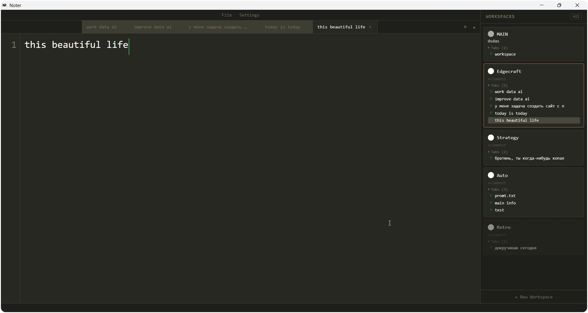
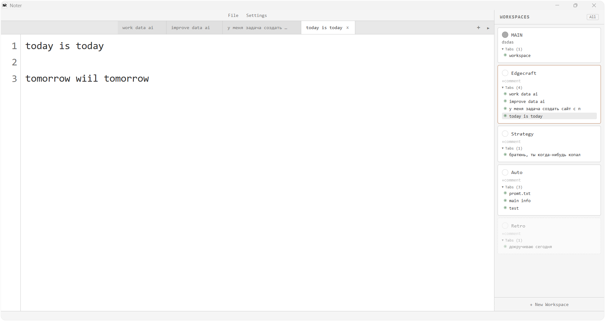
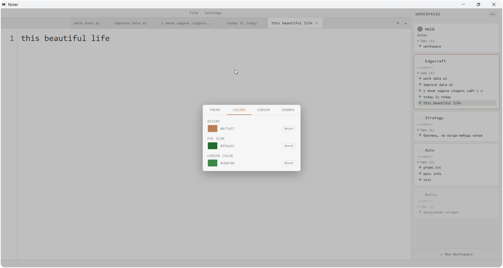

# ntr

A minimalist text editor for Windows with support for dashboards and page grouping.

Works with text files, supports automatic session saving, and offers both light and dark themes.



### Light theme



### Dark theme with workspaces



### Workspaces



### Settings



## Features

- Workspaces for organizing tabs into groups
- Drag-and-drop tabs between workspaces
- Automatic session saving and restoration
- Open `.txt` files directly (file association support)
- Single instance mode -- new files open in the existing window
- Save / Save As with keyboard shortcuts (Ctrl+S / Ctrl+Shift+S)
- Multiple color themes (Monokai, Sixteen, Celeste, Breeze)
- Customizable accent, cursor, and eye icon colors
- Adjustable cursor thickness and height

## Tech Stack

- [Tauri v2](https://v2.tauri.app/) (Rust backend)
- React 19 + TypeScript
- Zustand (state management)
- Vite

## Build

Prerequisites: [Node.js](https://nodejs.org/), [Rust](https://rustup.rs/), [Tauri CLI](https://v2.tauri.app/start/prerequisites/)

```bash
npm install
npx tauri build
```

The compiled executable will be at `src-tauri/target/release/ntr.exe`.

## Development

```bash
npx tauri dev
```

## License

MIT
